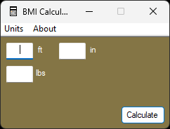
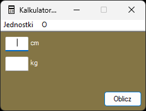

# bmiCalculator2 - A simple BMI Calculator for Windows written in ANSI C




### Supported languages

* English
* Polish

#### Supports both metric and imperial (US & UK) unit systems.

## Requirements for pre-compiled binaries

* Windows 7 SP1 or newer
* [Microsoft Visual C++ Redistributable 2022](https://learn.microsoft.com/en-US/cpp/windows/latest-supported-vc-redist)

Pre-compiled binaries are built with the latest (at the time of the release) stable version of Visual Studio 2022.
x64 binaries are compiled with clang-cl, while x86 ones are compiled with cl.
Build flags are the same as in CMakeLists.txt

## Building

Note: These instructions are for creating builds which replicate the pre-compiled binaries.

### Requirements

* Visual Studio (tested with 2015 and 2022) with "Desktop Development with C++" workload installed
* CMake 3.24+ (included with current versions of VS 2022; earlier versions of CMake may work after change in
  CMakeLists.txt, but
  I didn't test)

### How to build

1. Download or clone this repository
2. Open Developer PowerShell for VS 2022 (or Developer Powershell for your version of VS)
3. Change directory (cd) to the path containing source tree
4. Type:

```powershell
mkdir build
cd build
cmake -G "Visual Studio 17 2022" .. # Replace "Visual Studio 17 2022" with your VS version if needed
msbuild bmiCalculator2.sln /p:Configuration=Release
```

5. Enjoy! The binary will be located in the "Release" folder

Currently, you need Visual Studio to build the 'master' branch.
MinGW is not supported because windres does not support .rc files encoded in UTF16-LE which is required for non-ANSI
characters in resources.
CMakeLists.txt includes build flags for MinGW for future use.
You can use the 'englishonly' branch if you want to build with MinGW.

## License

This program is distributed under the MIT license.
Full license text can be found in LICENSE.txt
